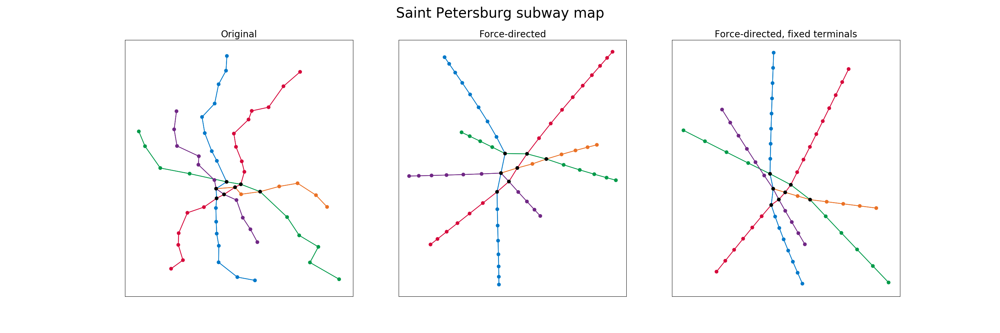
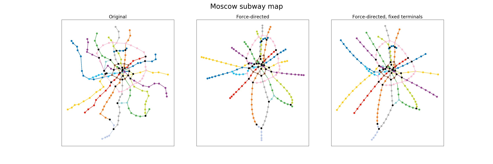

## Subway map layout
Implementation of force-directed graph drawing algorithm for subway map layout.

Assignment of Data Visualization course, MIPT, 2018.

#### Requirements

Python 3.5+

`pip3 install -r requirements.txt`

#### Related work

The Metro Map Layout Problem, Seok-Hee Hong et al. https://pdfs.semanticscholar.org/1a70/e421477293d06d2d6e60524b42f773fe6e8a.pdf

#### Algorithm

Fruchterman–Reingold algorithm source: http://citeseerx.ist.psu.edu/viewdoc/download?doi=10.1.1.13.8444&rep=rep1&type=pdf 

It's an iterative algorithm which simulates repulsive forces between all nodes and attractive forces between adjacent nodes.

Implementation is at `layout.py`

#### Data

Moscow and Saint Petersburg subway maps were used for experiments.

To get subway map with geo positions hh.ru API was used: https://api.hh.ru/metro/1.

#### Experiments

For simplicity interconnected stations are considered as one for algirithm as well as for visualization (those are colored black).

Stations and lines names are not drawn because it's another complex problem to locate them optimally and labels will distract from graph layout quality estimation. 

For all experiments geo position of stations were used as initial position of graph nodes.

In the final script 2 variants of algorithm application are presented:
* pure one
* with fixed position of terminal stations

It can be seen that algorithm helps to make lines straighter and edges length more uniform which is important for map readability. The results are far from perfect though as there are multiple criteria of good subway layout aren't met.

To reproduce the results run `main.py`

#### Failed experiments

Also few modifications of the algorithm with additional attractive forces were tried:
* to keep edges direction close to corresponding line direction
* to keep edges direction close to horizontal, vertical and 45 degrees
* to keep nodes close to their initial positions

Those didn't result in good layouts thought. The code is at `layout_custom.py`.
